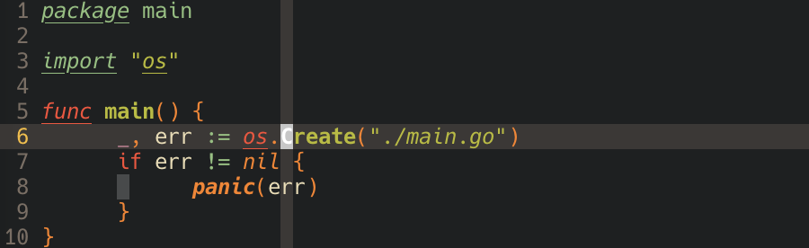
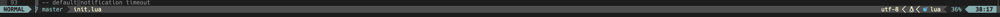

# NeoVim setup

Personal NeoVim setup.

## Introduction

This repo hosts my nvim configuration for my macbook. Whole configuration is at "init.vim" and ./lua/init.lua

## Requirements

Install neovim and python support for neovim

```
brew install neovim
pyton3 -m pip install pynvim
```

Install font to support some icons, and set it in the terminal configuration

```
brew tap homebrew/cask-fonts && brew install --cask font-hack-nerd-font
```

## Configurations

This config use [vim-plug](https://github.com/junegunn/vim-plug) as plug-in manager. Installation guide can be found in the official repo.

### Source immediately after configurations changes

```vim
" Source immediately after configurations changes
autocmd BufWritePost $MYVIMRC source $MYVIMRC
```

### Global configurations

Set leader to <space>

```vim
let mapleader=" "
```

Enable auto detect filetype and use specified plug-in for certain filetype

```vim
filetype on
filetype plugin on
```

Spell check

```vim
" enable spell checking
set spell spelllang=en_gb
" add word to spell list
nnoremap <Leader>as zg
```

True colour

```vim
if has("termguicolors")
    " enable true colour
    set termguicolors
endif
```

Search settings

```vim
" enable real time search
set incsearch
" ignore case while searching
set ignorecase
" highlight search result
set hlsearch
```

Syntax highlighting

```vim
" enable syntax highlighting
syntax enable
" enable use plugin syntax highlighting
syntax on
```

Colour Scheme, download .vim colour file from [gruvbox8](https://github.com/lifepillar/vim-gruvbox8/tree/master/colors), and copy it to "~/.config/nvim/colors"

```vim
set background=dark
colorscheme gruvbox8_hard
```

Indent

```vim
" set different indent mode for different filetype
filetype indent on
" expand tab to spaces
set expandtab
" set one tab means 6 spaces
set tabstop=4
" expand one tab to 6 spaces
set shiftwidth=4
" let vim to see 6 spaces as a tab
set softtabstop=4
```

Folding

```vim
" set foldmethod based on indent and syntax
set foldmethod=indent
set foldmethod=syntax
" close the folded code when vim start
set nofoldenable
" open / close code
nmap oz za
" open all folded code
nmap oaz zR
" close all folded code
nmap caz zM
```

Misc settings

```vim
" disable compatible mode
set nocompatible

" enable vim command auto-completion
set wildmenu

" disable line wrap
set nowrap

" always display the status bar
set laststatus=2
" display position of cursor
set ruler
" display the line numbers
set number
" highlight the current line and column
set cursorline
set cursorcolumn

" disable cursor blinking
set gcr=a:block-blinkon0
```

### Shortcuts

Shortcuts to jump to the begin of line and to the end of a line

```vim
" Shortcuts to jump to the begin of line and to the end of a line
" line begin
nmap ` 0
vnoremap ` 0
" line end
nmap = $
vnoremap = $
```

Copy and paste

```vim
" copy to the system clipboard
vnoremap <Leader>y "+y
" paste from the system clipboard
nmap <Leader>p "+p
```

Jump to window

```vim
" jump to the next window
nnoremap nw <C-W><C-W>
" jump to the right window
nnoremap <Leader>dw <C-W>l
" jump to the left window 
nnoremap <Leader>aw <C-W>h
" jump to the upper window
nnoremap <Leader>ww <C-W>k
" jump to the below window
nnoremap <Leader>sw <C-W>j
```

Jump between matched quotes and brackets

```
" jump between matched quotes or brackets
nmap <Leader>m %
```

File path complete

```vim
" file path complete
inoremap <C-s> <C-x><C-f>
```

## Functions

### Format Json

```vim
" formate json file
function! FormateJson()
    exe "%!python3 -m json.tool --indent 4" 
endfunction
```

### Save vim session

```vim
" vim session 的自动保存
function! MakeSession()
      let b:sessiondir = $HOME . "/.local/share/nvim/sessions/" . getcwd()
      if (filewritable(b:sessiondir) != 2)
            exe 'silent !mkdir -p ' b:sessiondir
            redraw!
      endif
      let b:filename = b:sessiondir . '/session.vim'
      exe "mksession! " . b:filename
endfunction
au VimLeave * :call MakeSession()
```

### Auto format the document

```vim
" auto format
augroup fmt
autocmd!
autocmd BufWritePre * undojoin | Neoformat
augroup END
```

### Lua

Load some configurations from init lua file at `~/.config/nvim/lua/init.lua`

```vim
autocmd VimEnter *  :lua require('init')
```

## Plug-ins

### Indent guide



Install the Plug-in

```vim
Plug 'nathanaelkane/vim-indent-guides'
```

Plug-in configurations

```vim
" let the indent guide start on vim start
let g:indent_guides_enable_on_vim_startup=1
" start the indent visualization from the second layer
let g:indent_guides_start_level=2
" the width of the indent visualization
let g:indent_guides_guide_size=1
" use <Leader>it to open / close the visualization of indent
nmap <silent> <Leader>it <Plug>IndentGuidesToggle
```

### MinibufExplorer

```vim
" MiniBufExplorer
" Plug 'fholgado/minibufexpl.vim'
map <S-d> :MBEbn<cr>
map <S-a> :MBEbp<cr>
let g:miniBufExplBuffersNeeded = 1
" 默认时，打开的 window 占据几乎整个 vim 编辑区域，如果你想把多个 window 平铺成多个子窗口可以使用 MiniBufExplorer 的 s 和 v 命令：
" 在某个 buffer 上键入 s 将该 buffer 对应 window 与先前 window 上下排列，
" 键入 v 则左右排列
" use :bd (buffer number) to close a buffer
```

### Bookmark

```vim
" 书签
" Plug 'kshenoy/vim-signature'
" Plug 'vim-scripts/BOOKMARKS--Mark-and-Highlight-Full-Lines'
" 书签快捷键设置
" m,           Place the next available mark
" m.           If no mark on line, place the next available mark. Otherwise,
"              remove (first) existing mark.
" m-           Delete all marks from the current line
let g:SignatureMap = {
      \ 'Leader'             :  "m",
      \ 'PlaceNextMark'      :  "m,",
      \ 'ToggleMarkAtLine'   :  "m.",
      \ 'PurgeMarksAtLine'   :  "m-",
      \ 'DeleteMark'         :  "dm",
      \ 'PurgeMarks'         :  "m<Space>",
      \ 'PurgeMarkers'       :  "m<BS>",
      \ 'GotoNextLineAlpha'  :  "']",
      \ 'GotoPrevLineAlpha'  :  "'[",
      \ 'GotoNextSpotAlpha'  :  "`]",
      \ 'GotoPrevSpotAlpha'  :  "`[",
      \ 'GotoNextLineByPos'  :  "]'",
      \ 'GotoPrevLineByPos'  :  "['",
      \ 'GotoNextSpotByPos'  :  "]`",
      \ 'GotoPrevSpotByPos'  :  "[`",
      \ 'GotoNextMarker'     :  "]-",
      \ 'GotoPrevMarker'     :  "[-",
      \ 'GotoNextMarkerAny'  :  "]=",
      \ 'GotoPrevMarkerAny'  :  "[=",
      \ 'ListBufferMarks'    :  "m/",
      \ 'ListBufferMarkers'  :  "m?"
      \ }
```

### GitHub copilot

```vim
" github copilot
Plug 'github/copilot.vim'
" copilot node.js@16 version setup
let g:copilot_node_command = "/opt/homebrew/opt/node@16/bin/node"
```

### NeoFormat

```vim
" Neoformat
" code formater
" Plug 'sbdchd/neoformat'
let g:neoformat_rust_rustfmt = {
    \ 'exe': 'rustfmt',
    \ 'args': ['--edition 2021'],
    \ 'stdin': 1
    \ }
" rust fmt auto save
let g:rustfmt_autosave = 1
" auto format
augroup fmt
autocmd!
autocmd BufWritePre * undojoin | Neoformat
augroup END
```

### coc-nvim

```vim
" May need for Vim (not Neovim) since coc.nvim calculates byte offset by count
" utf-8 byte sequence
set encoding=utf-8
" Some servers have issues with backup files, see #649
set nobackup
set nowritebackup

" Having longer updatetime (default is 4000 ms = 4s) leads to noticeable
" delays and poor user experience
set updatetime=300

" Always show the signcolumn, otherwise it would shift the text each time
" diagnostics appear/become resolved
set signcolumn=yes

" Use tab for trigger completion with characters ahead and navigate
" NOTE: There's always complete item selected by default, you may want to enable
" no select by `"suggest.noselect": true` in your configuration file
" NOTE: Use command ':verbose imap <tab>' to make sure tab is not mapped by
" other plugin before putting this into your config
inoremap <silent><expr> <TAB>
      \ coc#pum#visible() ? coc#pum#next(1) :
      \ CheckBackspace() ? "\<Tab>" :
      \ coc#refresh()
inoremap <expr><S-TAB> coc#pum#visible() ? coc#pum#prev(1) : "\<C-h>"

" Make <CR> to accept selected completion item or notify coc.nvim to format
" <C-g>u breaks current undo, please make your own choice
inoremap <silent><expr> <CR> coc#pum#visible() ? coc#pum#confirm()
                              \: "\<C-g>u\<CR>\<c-r>=coc#on_enter()\<CR>"

function! CheckBackspace() abort
  let col = col('.') - 1
  return !col || getline('.')[col - 1]  =~# '\s'
endfunction

" Use <c-space> to trigger completion
if has('nvim')
  inoremap <silent><expr> <c-space> coc#refresh()
else
  inoremap <silent><expr> <c-@> coc#refresh()
endif

" Use `[g` and `]g` to navigate diagnostics
" Use `:CocDiagnostics` to get all diagnostics of current buffer in location list
nmap <silent> [g <Plug>(coc-diagnostic-prev)
nmap <silent> ]g <Plug>(coc-diagnostic-next)

" GoTo code navigation
nmap <silent> gd <Plug>(coc-definition)
nmap <silent> gy <Plug>(coc-type-definition)
nmap <silent> gi <Plug>(coc-implementation)
nmap <silent> gr <Plug>(coc-references)

" Use K to show documentation in preview window
nnoremap <silent> K :call ShowDocumentation()<CR>

function! ShowDocumentation()
  if CocAction('hasProvider', 'hover')
    call CocActionAsync('doHover')
  else
    call feedkeys('K', 'in')
  endif
endfunction

" Highlight the symbol and its references when holding the cursor
autocmd CursorHold * silent call CocActionAsync('highlight')

" Symbol renaming
nmap <leader>rn <Plug>(coc-rename)

" Formatting selected code
xmap <leader>f  <Plug>(coc-format-selected)
nmap <leader>f  <Plug>(coc-format-selected)

augroup mygroup
  autocmd!
  " Setup formatexpr specified filetype(s)
  autocmd FileType typescript,json setl formatexpr=CocAction('formatSelected')
  " Update signature help on jump placeholder
  autocmd User CocJumpPlaceholder call CocActionAsync('showSignatureHelp')
augroup end

" Applying code actions to the selected code block
" Example: `<leader>aap` for current paragraph
xmap <leader>a  <Plug>(coc-codeaction-selected)
nmap <leader>a  <Plug>(coc-codeaction-selected)

" Remap keys for applying code actions at the cursor position
nmap <leader>ac  <Plug>(coc-codeaction-cursor)
" Remap keys for apply code actions affect whole buffer
nmap <leader>as  <Plug>(coc-codeaction-source)
" Apply the most preferred quickfix action to fix diagnostic on the current line
nmap <leader>qf  <Plug>(coc-fix-current)

" Remap keys for applying refactor code actions
nmap <silent> <leader>re <Plug>(coc-codeaction-refactor)
xmap <silent> <leader>r  <Plug>(coc-codeaction-refactor-selected)
nmap <silent> <leader>r  <Plug>(coc-codeaction-refactor-selected)

" Run the Code Lens action on the current line
nmap <leader>cl  <Plug>(coc-codelens-action)

" Map function and class text objects
" NOTE: Requires 'textDocument.documentSymbol' support from the language server
xmap if <Plug>(coc-funcobj-i)
omap if <Plug>(coc-funcobj-i)
xmap af <Plug>(coc-funcobj-a)
omap af <Plug>(coc-funcobj-a)
xmap ic <Plug>(coc-classobj-i)
omap ic <Plug>(coc-classobj-i)
xmap ac <Plug>(coc-classobj-a)
omap ac <Plug>(coc-classobj-a)

" Remap <C-f> and <C-b> to scroll float windows/popups
if has('nvim-0.4.0') || has('patch-8.2.0750')
  nnoremap <silent><nowait><expr> <C-f> coc#float#has_scroll() ? coc#float#scroll(1) : "\<C-f>"
  nnoremap <silent><nowait><expr> <C-b> coc#float#has_scroll() ? coc#float#scroll(0) : "\<C-b>"
  inoremap <silent><nowait><expr> <C-f> coc#float#has_scroll() ? "\<c-r>=coc#float#scroll(1)\<cr>" : "\<Right>"
  inoremap <silent><nowait><expr> <C-b> coc#float#has_scroll() ? "\<c-r>=coc#float#scroll(0)\<cr>" : "\<Left>"
  vnoremap <silent><nowait><expr> <C-f> coc#float#has_scroll() ? coc#float#scroll(1) : "\<C-f>"
  vnoremap <silent><nowait><expr> <C-b> coc#float#has_scroll() ? coc#float#scroll(0) : "\<C-b>"
endif

" Use CTRL-S for selections ranges
" Requires 'textDocument/selectionRange' support of language server
nmap <silent> <C-s> <Plug>(coc-range-select)
xmap <silent> <C-s> <Plug>(coc-range-select)

" Add `:Format` command to format current buffer
command! -nargs=0 Format :call CocActionAsync('format')

" Add `:Fold` command to fold current buffer
command! -nargs=? Fold :call     CocAction('fold', <f-args>)

" Add `:OR` command for organize imports of the current buffer
command! -nargs=0 OR   :call     CocActionAsync('runCommand', 'editor.action.organizeImport')

" Add (Neo)Vim's native statusline support
" NOTE: Please see `:h coc-status` for integrations with external plugins that
" provide custom statusline: lightline.vim, vim-airline
set statusline^=%{coc#status()}%{get(b:,'coc_current_function','')}

" Mappings for CoCList
" Show all diagnostics
nnoremap <silent><nowait> <space>a  :<C-u>CocList diagnostics<cr>
" Manage extensions
nnoremap <silent><nowait> <space>e  :<C-u>CocList extensions<cr>
" Show commands
nnoremap <silent><nowait> <space>c  :<C-u>CocList commands<cr>
" Find symbol of current document
nnoremap <silent><nowait> <space>o  :<C-u>CocList outline<cr>
" Search workspace symbols
nnoremap <silent><nowait> <space>s  :<C-u>CocList -I symbols<cr>
" Do default action for next item
nnoremap <silent><nowait> <space>j  :<C-u>CocNext<CR>
" Do default action for previous item
nnoremap <silent><nowait> <space>k  :<C-u>CocPrev<CR>
" Resume latest coc list
nnoremap <silent><nowait> <space>p  :<C-u>CocListResume<CR>
```

#### coc-spell-checker / cspell

```vim
" use command to add to user dictionary
coccommand cspell.addtouserdictionary


" use <Space a> to enter code action mode
```

config:

```json
{"cSpell.language": "en-GB"}
```

#### coc-rust-analyser

```json
{
    "rust-analyzer.check.command": "clippy",
    "rust-analyzer.check.features": "all"
}
```

#### coc-tailwindcss

```json
{
    "tailwindCSS.includeLanguages": {
        "eelixir": "html",
        "elixir": "html",
        "eruby": "html",
        "html.twig": "html",
        "javascript": "javascriptreact",
        "rs": "html",
        "rust": "html"
    }
}
```

### Lua Line



```vim
Plug 'nvim-lualine/lualine.nvim'
" If you want to have icons in your statusline choose one of these
Plug 'kyazdani42/nvim-web-devicons'
```

```lua
-- lualine
require('lualine').setup()
```

### Easy Motion

```vim
" look
Plug 'Lokaltog/vim-easymotion'
```

### Search

!(search)[./imgs/5.png]

```vim
" search
Plug 'kevinhwang91/nvim-hlslens'
```

```lua
-- search status
local kopts = {noremap = true, silent = true}
vim.api.nvim_set_keymap('n', 'n',
    [[<Cmd>execute('normal! ' . v:count1 . 'n')<CR><Cmd>lua require('hlslens').start()<CR>]],
    kopts)
vim.api.nvim_set_keymap('n', 'N',
    [[<Cmd>execute('normal! ' . v:count1 . 'N')<CR><Cmd>lua require('hlslens').start()<CR>]],
    kopts)
vim.api.nvim_set_keymap('n', '*', [[*<Cmd>lua require('hlslens').start()<CR>]], kopts)
vim.api.nvim_set_keymap('n', '#', [[#<Cmd>lua require('hlslens').start()<CR>]], kopts)
vim.api.nvim_set_keymap('n', 'g*', [[g*<Cmd>lua require('hlslens').start()<CR>]], kopts)
vim.api.nvim_set_keymap('n', 'g#', [[g#<Cmd>lua require('hlslens').start()<CR>]], kopts)
vim.api.nvim_set_keymap('n', '<Leader>l', ':noh<CR>', kopts)

```
